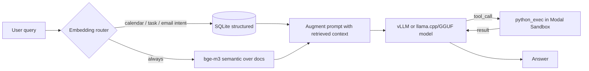

# Vietnamese AI Secretary — LLM on Modal

[](https://github.com/khoa-na/vietnamese-secretary-llm/actions/workflows/tests.yml)
[](LICENSE)

A serverless **Modal** evaluation stack for a Vietnamese enterprise secretary chatbot — with vLLM and llama.cpp/GGUF targets, server-side hybrid RAG, deterministic Python tool-calling, and a multi-judge evaluation harness.

## Highlights

- **Benchmarked vLLM and GGUF targets across 97 test cases** with a custom LLM-as-Judge harness (8 weighted criteria, multi-run consistency penalty, RAG grounding checks).
- **Current GGUF candidate**: `unsloth/gemma-4-12b-it-GGUF` reaches **63/63 chat** and **34/34 RAG live** by multi-judge consensus after fixing its GGUF tool-call parser.
- **Server-side hybrid RAG** (structured SQLite + semantic bge-m3, embedding intent router) reaching **recall@4 = 100%** on the 34-case retrieval suite.
- **Found and fixed 3 real retrieval bugs through evaluation** — a Vietnamese accent collision (`tối`/`tôi`), a substring name-match leak, and a debug cosine score leaking into the prompt and causing hallucination.
- **Deterministic tool-calling**: models offload arithmetic/date math to a sandboxed `python_exec` (isolated Modal Sandbox, no network). The GGUF app also handles Gemma-style `<|tool_call>...` text tool calls.
- **Serverless cost optimization**: scale-to-zero (`scaledown_window`) plus CPU memory snapshotting to cut cold-start time.

## Architecture



- **Hybrid RAG** — structured retrieval (calendar / tasks / emails via in-memory SQLite, relative-date parsing) plus semantic retrieval (`.md` docs via bge-m3), with intent routing by embedding similarity to anchor sentences.
- **Tool-calling** — `python_exec` runs deterministic computation inside an isolated Modal Sandbox.
- **Serving targets** — `modal_app.py` for vLLM models and `modal_gguf_app.py` for GGUF models through llama.cpp.
- **Evaluation** — an LLM-as-Judge harness over chat and live-RAG test sets, with single-judge and multi-judge consensus reports.

## Results

## Evaluation Criteria

The judge scores each answer on a 0-100 scale. A case is considered **PASS** at
`>= 60`, and **production-ready** at `>= 75`.

The criteria are defined in [`eval/criteria.py`](eval/criteria.py) and attached
to each case in `eval/test_cases_*.yaml`. README keeps the short version:

| Code | Criterion | What it checks |
|---|---|---|
| `TC-01` | Accuracy | Correct facts, numbers, extracted fields, and final answer. |
| `TC-02` | Intent recognition | Whether the assistant understands what the user is asking. |
| `TC-03` | Multi-turn context | Whether it keeps context across turns and handles corrections. |
| `TC-04` | Language quality | Vietnamese tone, clarity, grammar, and professional secretary style. |
| `TC-05` | Multilingual support | Correct behavior for English, Vietnamese, and mixed-language requests. |
| `TC-06` | Temporal reasoning | Date math, relative dates, deadlines, weekdays, quarters, and time windows. |
| `TC-08` | Robustness | Edge cases, missing data, refusals, contradictions, and typo-heavy input. |
| `TC-09` | Consistency | Stability across repeated runs for the same task. |
| RAG grounding | Source faithfulness | Whether answers are grounded in retrieved calendar/task/email/document data. |

For multi-run consistency cases, the runner can execute the same case multiple
times and penalize high score variance. For RAG live cases, the judge receives
the retrieved source text and checks both correctness and grounding.

### Current GGUF Result

Target: `unsloth/gemma-4-12b-it-GGUF` using `gemma-4-12b-it-UD-Q4_K_XL.gguf`, served by `modal_gguf_app.py` through llama.cpp on Modal.

Judges: `gemini-3.1-flash-lite`, `deepseek-v4-flash`, `qwen/qwen3.6-flash`.

| Test set | Cases | Multi-judge PASS | Overall avg | Report |
|---|---:|---:|---:|---|
| Chat | 63 | **63/63 (100.0%)** | **96.4** | `eval/results/judge/eval_report_judge__chat__unsloth_gemma-4-12b-it-GGUF__multi_judge.md` |
| RAG live | 34 | **34/34 (100.0%)** | **95.1** | `eval/results/judge/eval_report_judge__rag_live__unsloth_gemma-4-12b-it-GGUF__multi_judge.md` |

The GGUF result is after fixing the model-specific text tool-call format:

```text
<|tool_call>call:python_exec{code:<|"|>...<|"|>}<tool_call|>
```

Before this fix, the app returned raw tool-call text instead of executing `python_exec`, causing date/math cases to fail. The current reports use regenerated subset outputs for the affected cases and rebuilt multi-judge consensus.

### vLLM 3-Way Baseline

Across 97 cases (chat 63 + rag_live 34), judged by `gemini-3.1-flash-lite` (same config, only `MODEL_NAME` changes):

| Model | Params | PASS | Production-ready (>=75) | Overall |
|---|---|---|---|---|
| DeepSeek-R1-0528-Qwen3-8B | 8B | 97.9% | 95.9% | **94.7** |
| Gemma 4-E4B | ~4.5B eff. | 96.9% | 92.8% | 94.2 |
| Qwen3.5-9B | 9B | 94.8% | 90.7% | 92.1 |

Per set: DeepSeek leads **chat** (95.6), Gemma E4B leads **rag_live** (94.1). Full reports and methodology in [`eval/comparisons/`](eval/comparisons/).

## Demo

Real response combining retrieval and tool-calling (more in [`docs/DEMO.md`](docs/DEMO.md)):

> **User:** `tỷ suất lợi nhuận sau thuế trên doanh thu quý 1 là bao nhiêu phần trăm` (what is the Q1 net profit margin?)
>
> **Assistant:** `Tỷ suất lợi nhuận sau thuế trên doanh thu quý 1/2026 là 12,12%.`

The model retrieves the two figures from the financial report (revenue 48.2, net profit 5.84), then computes the ratio deterministically instead of guessing:

```python
# python_exec, executed in an isolated Modal Sandbox
ty_suat = (5.84 / 48.2) * 100
print(f"{ty_suat:.2f}")   # => 12.12
```

## Layout

```
modal_app.py            # LLMServer (vLLM) + RAG augmentation + agentic tool loop + HTTP endpoint
modal_gguf_app.py       # LLMServer (llama.cpp/GGUF) + RAG + python_exec tool loop
retrieval.py            # Hybrid retriever: SQLite structured + bge-m3 semantic + embedding router
rag_corpus/             # Seed data: calendar.json, tasks.json, emails.json, docs/*.md
modal_client.py         # Call the endpoint from your machine (SDK / HTTP)
eval/
  run_eval_judge.py     # Orchestrator: generate -> judge -> markdown report
  config|target|judge|criteria|report.py
  test_cases_{chat,rag,rag_live}.yaml
  eval_retrieval.py     # measure retrieval recall@k (decoupled from generation)
  rag_diagnose.py       # tune the embedding-router threshold
  comparisons/          # model comparison reports (3-way, 2-way)
test_retrieval.py       # CPU-only unit tests (FakeEmbedder, no GPU)
.env.example            # config template
```

## Models evaluated

| Model | `MODEL_NAME` | Notes |
|---|---|---|
| Qwen3.5-9B (default) | `Qwen/Qwen3.5-9B` | well-rounded, strong tool-calling |
| DeepSeek-R1-0528-Qwen3-8B | `deepseek-ai/DeepSeek-R1-0528-Qwen3-8B` | reasoning model, somewhat verbose |
| Gemma 4-E4B | `google/gemma-4-e4b-it` | gated (needs an HF token); runs text-only |
| Gemma 4 12B IT GGUF | `unsloth/gemma-4-12b-it-GGUF` | separate llama.cpp app; 4-bit GGUF; strongest current result after tool parser fix |

## Setup (one time)

```bash
python -m venv .venv
.venv\Scripts\pip install -r requirements.txt    # Windows  (Linux/macOS: .venv/bin/pip)
.venv\Scripts\modal token new                    # log in to Modal (opens a browser)
```

Copy `.env.example` to `.env` and fill in:

- `GEMINI_API_KEY` — for the LLM-as-Judge (get one at https://aistudio.google.com/apikey).
- `MODEL_NAME`, `MODAL_GPU` (default `L40S`), `MAX_MODEL_LEN`, `GPU_MEMORY_UTILIZATION`.

For a **gated** model (Gemma): create a Modal secret named `huggingface` holding `HF_TOKEN` (from an account that has accepted the license on Hugging Face).

## Deploy vLLM Target

```bash
.venv\Scripts\modal deploy modal_app.py
```

The output includes an **Endpoint URL** (HTTP). Copy it into `.env` as `MODAL_ENDPOINT_URL=...` if you want to call the service over HTTP.

## Quick test vLLM Target

```bash
# Local entrypoint (spawns one container, runs, then shuts down)
.venv\Scripts\modal run modal_app.py --question "what is on my calendar today"

# Via the client (after deploy)
.venv\Scripts\python modal_client.py "2+2=?"          # SDK
.venv\Scripts\python modal_client.py "2+2=?" http     # HTTP (requires MODAL_ENDPOINT_URL)
```

## Evaluation (LLM-as-Judge)

```bash
.venv\Scripts\python eval/run_eval_judge.py --set chat        # 63 conversational cases (inline data)
.venv\Scripts\python eval/run_eval_judge.py --set rag_live    # 34 RAG cases (real server-side retrieval)
.venv\Scripts\python eval/eval_retrieval.py                   # retrieval recall@k (cheap, no generation)
```

**Comparing another vLLM model:** change `MODEL_NAME` in `.env`, run `modal deploy modal_app.py`, then re-run the eval. Reports are written to `eval/results/judge/` (named with a model slug). The `generate` and `judge` stages can be run separately (see `--help`).

Example candidate:

```env
MODEL_NAME=google/gemma-4-12B-it
```

## GGUF / llama.cpp Target

`modal_gguf_app.py` is a separate Modal app for `unsloth/gemma-4-12b-it-GGUF`
4-bit GGUF, so the existing vLLM app remains unchanged. It exposes the same
`LLMServer.generate(...)` SDK method, supports server-side RAG, and runs
`python_exec` through Modal Sandbox.

The app includes a parser for Gemma/GGUF text tool calls such as
`<|tool_call>call:python_exec{...}<tool_call|>`, then forces a final Vietnamese
answer after the tool result is available.

```powershell
modal deploy modal_gguf_app.py
$env:MODAL_APP_NAME="test-llm-chatbot-thuky-gguf"
$env:GGUF_REPO_ID="unsloth/gemma-4-12b-it-GGUF"
$env:GGUF_FILENAME="gemma-4-12b-it-UD-Q4_K_XL.gguf"
$env:MODEL_NAME="unsloth/gemma-4-12b-it-GGUF"
$env:MAX_MODEL_LEN="16384"
.venv\Scripts\python eval/run_eval_judge.py generate --set chat
```

Run the current multi-judge eval:

```powershell
$env:JUDGE_MODELS="gemini-3.1-flash-lite,deepseek-v4-flash,qwen/qwen3.6-flash"
.venv\Scripts\python eval/run_eval_judge.py --set chat
.venv\Scripts\python eval/run_eval_judge.py --set rag_live
```

## Multi-Judge Evaluation

The original evaluation flow used one judge model at a time, usually Gemini. The
current flow supports **multi-LLM judging** so one judge's bias, quota issue, or
temporary provider error does not dominate the final score.

Set `JUDGE_MODELS` to a comma-separated list, or pass `--judge-models`. The runner writes:

- one report per judge model;
- one `__multi_judge.md` consensus report;
- a majority PASS/FAIL decision per case;
- the average score across judges.

Current judge panel:

| Judge | Provider | Config value |
|---|---|---|
| Gemini 3.1 Flash Lite | Google | `gemini-3.1-flash-lite` |
| DeepSeek V4 Flash | DeepSeek API | `deepseek-v4-flash` |
| Qwen 3.6 Flash | OpenRouter | `qwen/qwen3.6-flash` |

Consensus rule: a case is PASS if the majority of judge models pass it. The
average score is the mean of the available judge scores. This is the score used
for the current GGUF result table above.

```bash
.venv\Scripts\python eval/run_eval_judge.py --set rag_live --judge-models gemini-2.5-flash,deepseek-v4-flash,qwen/qwen3.6-flash
```

DeepSeek judge models are supported through the OpenAI-compatible API:

```env
DEEPSEEK_API_KEY=...
JUDGE_MODELS=gemini-3.1-flash-lite,deepseek-v4-flash
```

OpenRouter judge models use slugs like `qwen/qwen3.6-flash`:

```env
OPENROUTER_API_KEY=...
JUDGE_MODELS=gemini-3.1-flash-lite,deepseek-v4-flash,qwen/qwen3.6-flash
```

Retrieval unit tests (no GPU, uses a FakeEmbedder):

```bash
.venv\Scripts\python test_retrieval.py
```

## Key configuration (`.env`)

| Group | Variables |
|---|---|
| Serving | `MODEL_NAME`, `MODAL_APP_NAME`, `MODAL_GPU`, `MAX_MODEL_LEN`, `GPU_MEMORY_UTILIZATION`, `DTYPE`, `MAX_NUM_SEQS`, `GGUF_REPO_ID`, `GGUF_FILENAME`, `GGUF_N_GPU_LAYERS`, `GGUF_N_BATCH`, `GGUF_N_THREADS` |
| Tools | `USE_TOOLS` |
| RAG | `USE_RETRIEVAL`, `EMBED_MODEL` (bge-m3), `RAG_TOP_K`, `RAG_MIN_SCORE`, `RAG_ROUTE_MIN_SCORE`, `RAG_REFERENCE_DATE` |
| Judge / Eval | `JUDGE_MODEL`, `JUDGE_MODELS`, `JUDGE_TEMPERATURE`, `JUDGE_SEED`, `JUDGE_RPM`, `EVAL_MODE`, `EVAL_TEMPERATURE`, `EVAL_MAX_TOKENS`, `DEEPSEEK_API_KEY`, `DEEPSEEK_BASE_URL`, `OPENROUTER_API_KEY`, `OPENROUTER_BASE_URL` |

## Cost (Modal, rough)

GPU is billed per second while active; with `scaledown_window=5` the container shuts down about 5 seconds after the last request, dropping to $0. Subsequent cold starts (model already cached in a Volume) take roughly 10-20 seconds, and each inference request takes a few seconds.

## References

- Modal docs: https://modal.com/docs
- vLLM on Modal: https://modal.com/docs/examples/vllm_inference

## License

MIT — see [LICENSE](LICENSE).
